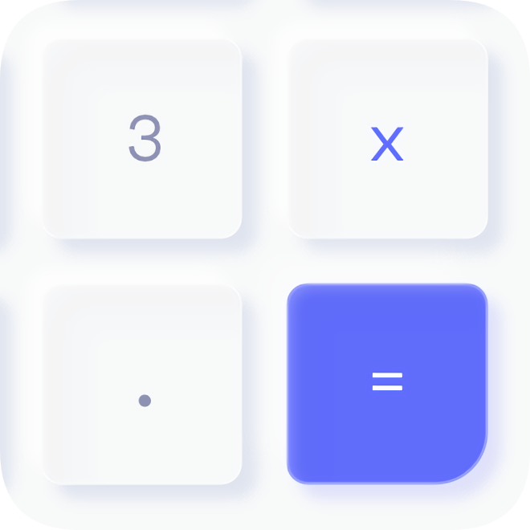
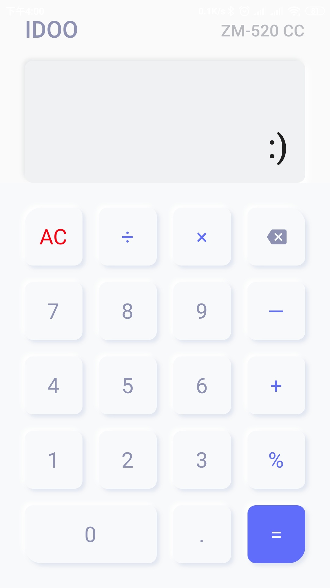
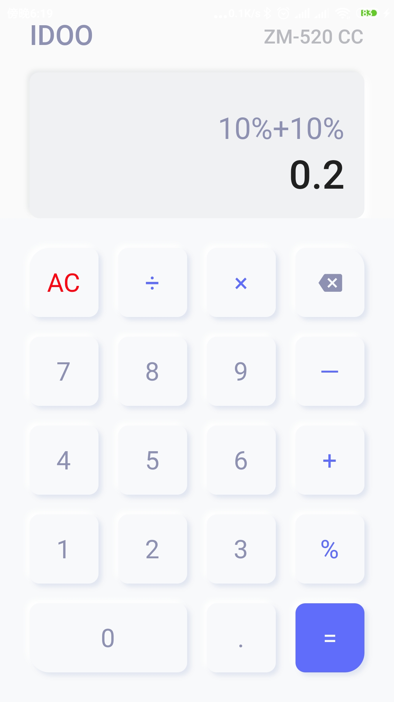
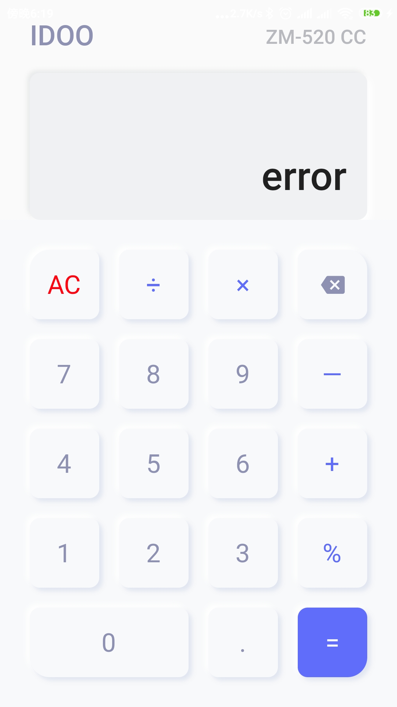

极简计算器

# 简介 

This is a neumorphic style calculator, it's just one of my Flutter interface practice projects, interface ideas and inspiration From the [Calculator UI by Duncan Ross](https://dribbble.com/shots/10076573-Calculator-UI)

一个新拟态风格的计算器，这是我的一个Flutter界面练习项目，界面创意与灵感来自于[Calculator UI by Duncan Ross](https://dribbble.com/shots/10076573-Calculator-UI) 

# 预览

|   |    |
| :------------: | :------------: | 

# 获取软件

该应用已上架酷安，下载地址：
https://www.coolapk.com/apk/com.cat.calculator

# 免责声明

本项目仅供学习交流。

# 鸣谢

neumorphic / neumorphic.flutter
https://github.com/neumorphic/neumorphic.flutter

jicg / flutter_cal
https://github.com/jicg/flutter_cal

